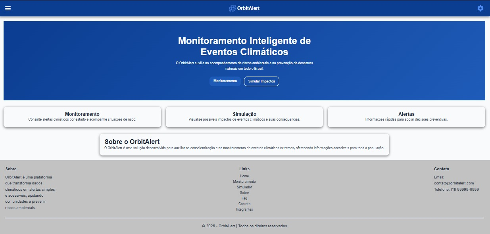
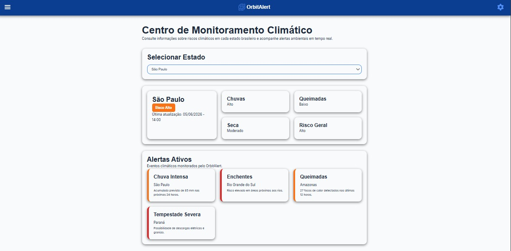
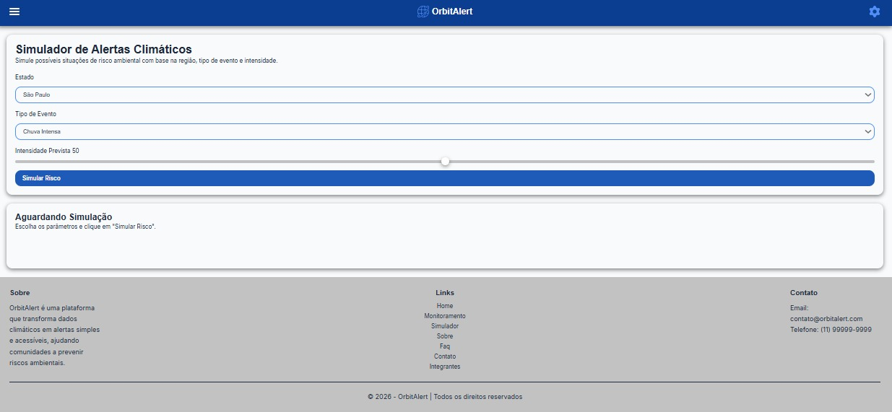
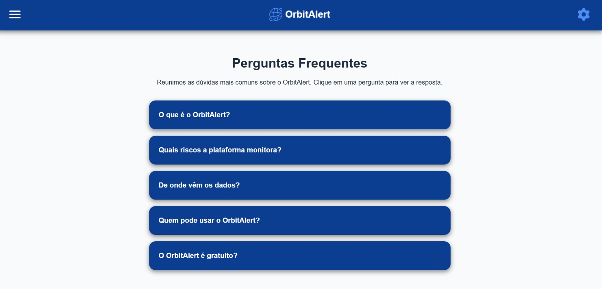
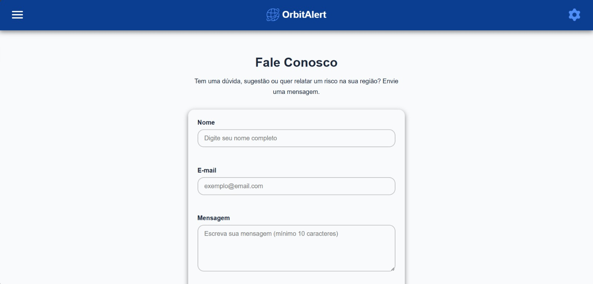

Tecnologias Utilizadas
Front-End
HTML5
CSS3
JavaScript (ES6)

Ferramentas
Git
GitHub
Visual Studio Code

Conceitos Aplicados
Responsividade
Componentização
Organização modular de arquivos
Persistência de tema utilizando Local Storage
Manipulação do DOM
Interface baseada em cards e painéis informativos

---

Funcionalidades
Página Inicial
Apresentação da plataforma
Navegação principal

Monitoramento
Consulta de alertas por estado
Exibição de riscos ambientais
Histórico de alertas simulados

Simulação
Simulação de cenários climáticos
Cálculo de impactos potenciais
Recomendações preventivas

Configurações
Alteração entre tema claro e escuro
Preferência salva automaticamente

Interface Responsiva
Mobile
Tablet
Desktop

---
Estrutura do Projeto
OrbitAlert/
│
├── assets/
│   ├── icones/
│   │   ├── configuracoes.png
│   │   ├── contato.png
│   │   ├── faq.png
│   │   ├── home.png
│   │   ├── integrantes.png
│   │   ├── logo.png
│   │   ├── monitoramento.png
│   │   ├── perfil.png
│   │   ├── simulacao.png
│   │   └── sobre.png
│   │
│   │── img-site/
│   │   ├── printSimulador.jpeg
│   │   ├── printContato.jpeg
│   │   ├── printFaq.jpeg
│   │   ├── printTelaPrincipal.jpeg
│   │   ├── printIntegrantes.jpeg
│   │   ├── printLogo.jpeg
│   │   ├── printMonitoramento.jpeg
│   │   └── printSobre.jpeg
│   │
│   └── fotos-integrantes/
│       ├── fotoMariana.jpeg
│       ├── fotoRodrigo.jpeg
│       ├── fotoCaio.jpeg
│       ├── fotoGabriel.jpeg
│       └── fotoJoao.jpeg
│   
├── css/
│   ├── base/
│   │   ├── global.css
│   │   ├── reset.css
│   │   ├── tipografia.css
│   │   └── variaveis.css
│   │
│   ├── componentes/
│   │   ├── alertas.css
│   │   │── botao.css
│   │   ├── cards.css
│   │   ├── config.css
│   │   ├── footer.css
│   │   ├── header.css
│   │   ├── ranges.css
│   │   ├── selects.css
│   │   ├── sidebar.css
│   │   └── status.css
│   │
│   ├── paginas/
│   │   ├── home.css
│   │   ├── monitoramento.css
│   │   ├── simulador.css
│   │   └── sobre.css
│   │
│   └── main.css
│
├── js/
│   ├── componentes/
│   │   ├── config.js
│   │   ├── menu.js
│   │   └── toast.js
│   │
│   ├── dados/
│   │   ├── estados.js
│   │   └── simulador-data.js
│   │
│   ├── paginas/
│   │   ├── monitoramento.js
│   │   └── simulador.js
│   │
│   └── main.js
│
├── paginas/
│   ├── monitoramento.html
│   ├── simulador.html
│   └── sobre.html
│
├── index.html
│
└── README.md
---

Imagens do Projeto
Logo

---

Página Inicial

---

Página Sobre

---

Página de Monitoramento

---

Página de Simulação

---

Página de FAQ

---

Página de Integrantes

---

Página de Contato

---
Integrantes
Mariana Ramos dos Santos
RM: 573686
Turma: 1TDS
GitHub: https://github.com/MariMari-Ramos
LinkedIn: www.linkedin.com/in/mariana-ramos-dos-santos861b582ba

Foto

---

Caio Marques da Silva
RM: 572760
Turma: 1TDS
GitHub: https://github.com/Caiomarqx
LinkedIn: https://www.linkedin.com/in/caio-marques-739926396

Foto

---

Gabriel Antonio Ferreira de França
RM: 573159
Turma: 1TDS
GitHub: https://github.com/AntonioGabrielFranca
LinkedIn: https://www.linkedin.com/in/gabriel-antonio-ferreira-91b3123bb/?skipRedirect=true

Foto

---

João Marcos Gouveia de Almeida
RM: 572687
Turma: 1TDS
GitHub: https://share.google/25NFV9hAY1EM2De6S
LinkedIn: https://www.linkedin.com/in/joao-marcos-gouveia-7089a83b4?utm_source=share_via&utm_content=profile&utm_medium=member_ios

Foto

---

Rodrigo Terra Costa
RM: 571840
Turma: 1TDS
GitHub: https://github.com/rodrigo15511
LinkedIn: https://www.linkedin.com/in/rodrigoterracosta

Foto

---
GitHub
MariMari-Ramos - Overview
MariMari-Ramos has 6 repositories available. Follow their code on GitHub.
Imagem
GitHub
Caiomarqx - Overview
Caiomarqx has 2 repositories available. Follow their code on GitHub.
Imagem
GitHub
AntonioGabrielFranca - Overview
AntonioGabrielFranca has 5 repositories available. Follow their code on GitHub.
Imagem
Repositório
Substitua pelo link oficial do projeto:

https://github.com/MariMari-Ramos/OrbitAlert

---

Como Executar
Clonar o repositório
git clone https://github.com/MariMari-Ramos/OrbitAlert

Acessar a pasta
cd OrbitAlert

Abrir o projeto
Abrir o arquivo:

index.html

em qualquer navegador moderno.

---

Contato
Para dúvidas ou sugestões:

Email: contato.orbitalert@gmail.com
GitHub: https://github.com/MariMari-Ramos/OrbitAlert

---

Considerações Finais
O OrbitAlert demonstra como conceitos inspirados na economia espacial e no monitoramento ambiental podem ser aplicados para criar ferramentas acessíveis de conscientização e prevenção de riscos climáticos.

O projeto busca aproximar tecnologia, informação e sociedade por meio de uma interface simples, responsiva e educativa.
GitHub
GitHub - MariMari-Ramos/OrbitAlert
Contribute to MariMari-Ramos/OrbitAlert development by creating an account on GitHub.